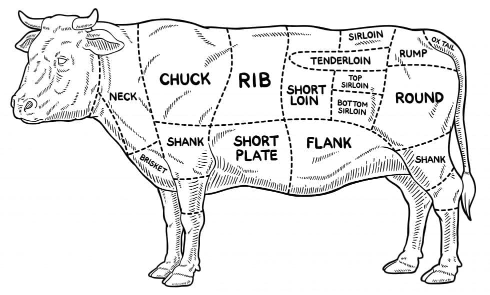
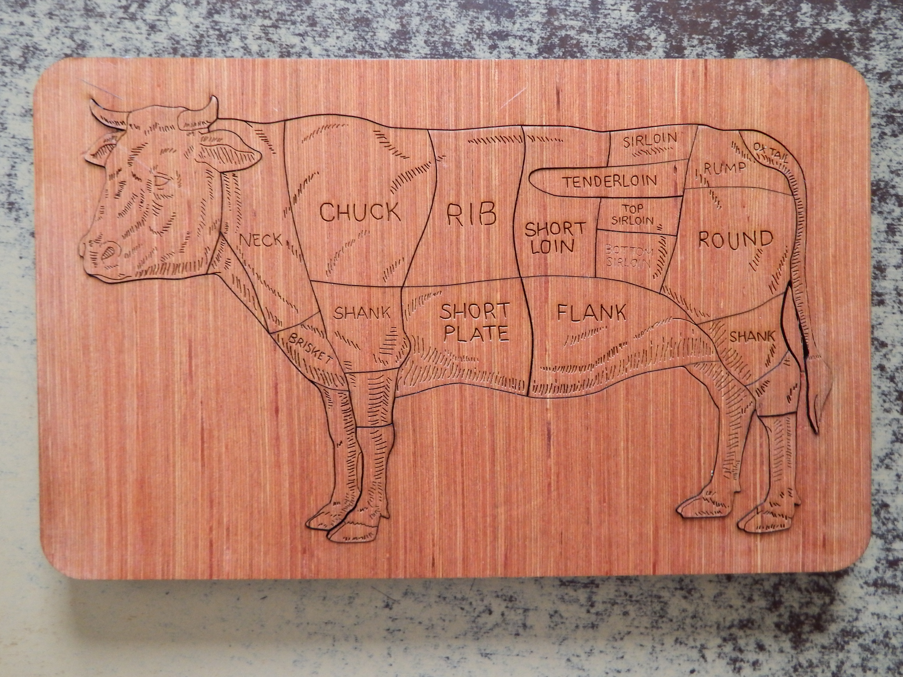
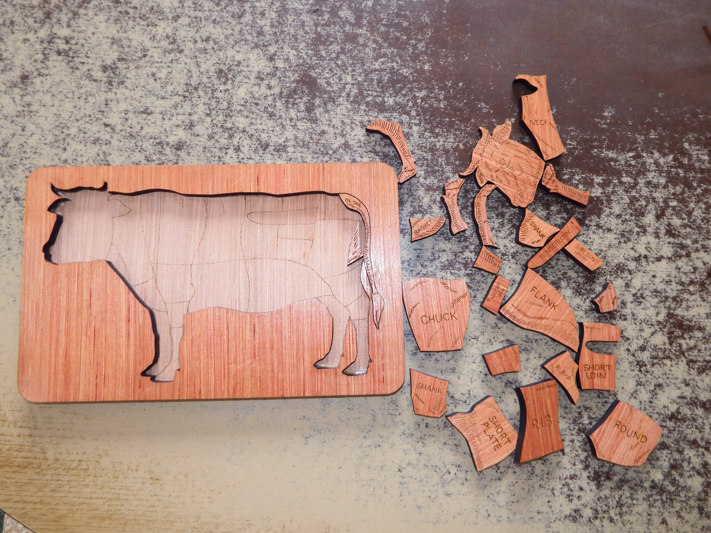

# quartier_de_boeuf
 Un dessin pour un puzzle. 
C'est bientôt la fête des mères ! Offrez cette merveilleuse planche à découper. 
Ainsi, après avoir découpé le roti dominical, votre maman pourra exercer ses neurones avec ce 
joli petit puzzle. 

Il est conseillé d'essuyer d'abord les traces de sang résiduelles. 

Par expérience, la queue et l'espace entre la queue et les pattes arrières sont très fragiles, il vaut mieux les coller (ou encore mieux, ne pas les découper). 

J'ai du 'forcer' la gravure (diviser la vitesse par 3, sinon, on ne voyait rien). 

J'ai chargé l'image en arrière plan dans Inkscape et j'ai créé les lignes de coupe et de gravure avec l'outil *tracer des segments de droite et des courbes
de Bezier*, puis je les ai améliorées avec * Editer les noeuds ...*

Le fichier *ledessin.svg* est prêt pour la découpe.

J'ai trouvé l'image sur internet, mais il n'y a ps de crédit, et donc je ne peux pas citer son auteur. Si vous êtes plus malin-maline que moi, je suis preneur. 

 
 
 
